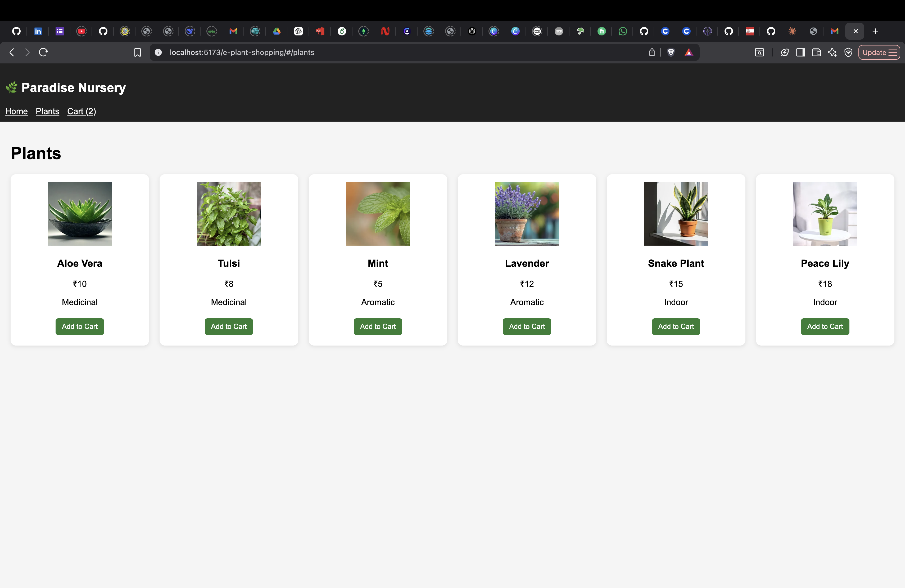
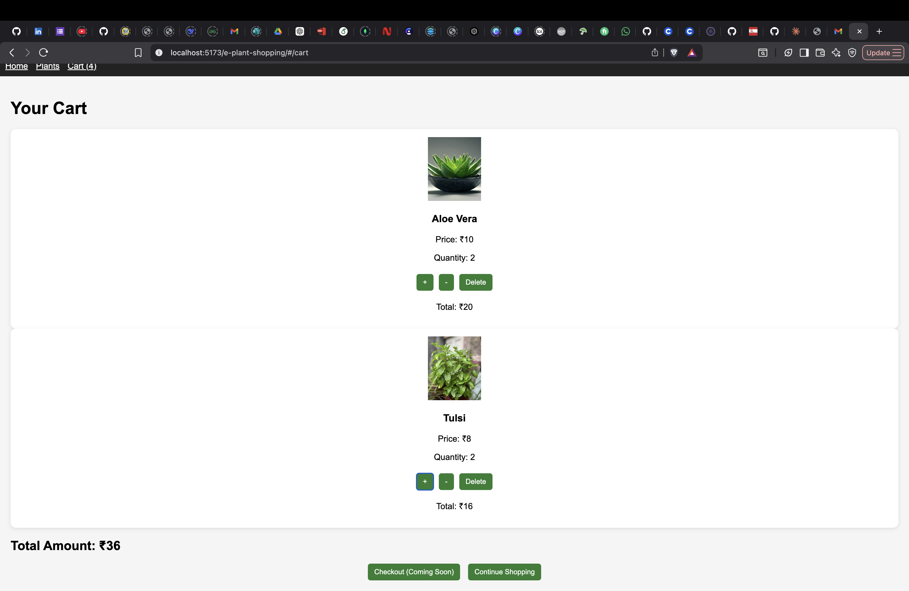

# 🌿 Paradise Nursery

A modern plant shopping web app built using React and Redux Toolkit.

## 🚀 Live Demo
https://tridipdowari.github.io/e-plant-shopping/

## ✨ Features
- Browse plants by category
- Add to cart with disabled state
- Increase / decrease quantity
- Remove items from cart
- Persistent cart (data saved after refresh)
- Dynamic total price calculation
- Search functionality

## 🛠 Tech Stack
- React (Vite)
- Redux Toolkit
- Redux Persist
- CSS Grid

## 📸 Screenshots
(Add 1–2 screenshots here)

## 📂 Project Structure
src/
 ├── components/
 ├── pages/
 ├── redux/
 ├── data/

## 📸 Screenshots

### Home Page

### Cart Page
